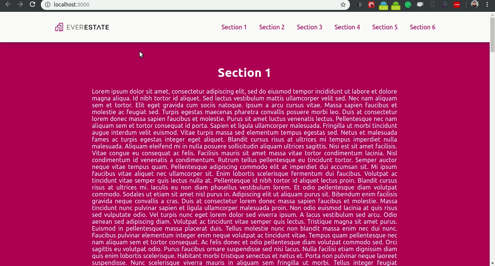

# React Smooth Scroll App

This is a project that building an app with a smooth scroll where the `navbar` items follow section scrolls.

## Project Structure

For this project, the structure of the App is based on `React`.

The structure is shown below.

```
- react-smooth-scroll-app
    - node-modules
    - public
    - src
        - Components
        - Constants
        - Image
        - MainApp (We have just a main page)
        - Style
        - Tests
```

- **Components**: This directory contains the app's components. We have `NavBar`, `Logo` and `Section`, where Section contains `Section`, and `ListSection`, that list the informed sections.

- **Constants**: This directory contains default information that we used on our website. This folder is used only if we don't have a **Backend** structure.

- **Image**: Store images in many formats.

- **MainApp**: This directory contains the application's `container` and `view`. This is the main structure.

- **Tests**: Contains the frontend tests.

- **Style**: Contains the default styles, mainly if you would like to change simple information for all app.

Example:

```css
export default {
  logoDefaultWidth: 60,
  logoDefaultHeight: 60,

  navShadowColor: 'rgba(0, 0, 0, 0.2)',
  navBgColor: '#FAFAFA',
  navTextColor: '#B0005B',
  ...
}
```

## Download

You can download the folder on my [GitHub](https://github.com/samaronybarros/react-smooth-scroll-app).

If you have git installed on your PC, you just need do as follow:

```shell
$ git clone https://github.com/samaronybarros/react-smooth-scroll-app.git
```

## Configuring App

```shell
$ cd react-smooth-scroll-app
$ npm install
```

## Starting App

```shell
$ npm start
```

## What you'll see?

#### Main App


#### Easy code change color


